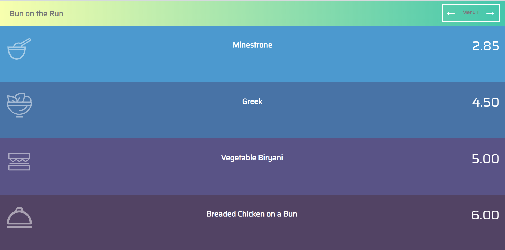

# Assignment 3

## Purpose

This vanilla JavaScript web app displays various daily menus which can be viewed by clicking either the next or previous buttons.  



## Concepts Learned

To create this "Bun on the Run" menu app the following JavaScript concepts were used:
- variables let vs const
- arrays
- querySelector() method
- fetch API
- display property
- Event Listener interface
- push() method
- textContent property
- classes and ids
- click event

## How I made the web app

1. First I defined a const called menus and assigned it to be an empty array
    ```js
    const menu = []
    ```
    The reason why I did that is because the menus array will eventually be assigned an array of objects where each object represents a daily menu, complete with menu items and prices.

1. Next I defined a let called currentIndex and assigned it to 0.
    ```js
    let currentIndex = 0;
    ```
    The reason why I did that is because we want to show first element of the array first. Then we will increment and decrement later.
    

1. Next I selected all elements with querySelector and assigned them to const variables(nextMenu, soup etc..)
    ```js
    const nextMenu = document.querySelector('#nextButton');
    const previousMenu = document.querySelector('#previousButton');
    const soup = document.querySelector("#soup h1");
    const soupPrice = document.querySelector("#soup p");
    const salad = document.querySelector("#salad h1");
    const saladPrice = document.querySelector("#salad p");
    const lighterfare = document.querySelector("#lighterfare h1");
    const lighterfarePrice = document.querySelector("#lighterfare p");
    const entree = document.querySelector("#entree h1");
    const entreePrice = document.querySelector("#entree p");
    const menuTitle = document.querySelector("#menu h2");
    ```
    The reason why I did that is because I want to change these elements. That's why I catched them and assigned to variables.

1. Next I defined a function and this function accepts a parameter named todaysmenu. 
    ```js
    function display(todaysmenu) {
        menuTitle.textContent = todaysmenu.title;
        soup.textContent = todaysmenu.soup;
        soupPrice.textContent = todaysmenu.soupPrice;
        salad.textContent = todaysmenu.salad;
        saladPrice.textContent = todaysmenu.saladPrice;
        lighterfare.textContent = todaysmenu.lighterFare;
        lighterfarePrice.textContent = todaysmenu.lighterFarePrice;
        entree.textContent = todaysmenu.entree;
        entreePrice.textContent = todaysmenu.entreePrice;
    }
    ```
    This function displays the current menu.  For example, it displays the menu title by using todaysmenu's title. We changed the text content of variables.

1. Next I defined a function called getJson which will fetch our menus data in JSON format
    ```js
    async function init() {
        const res = await fetch("https://gist.githubusercontent.com/dorukhanuzun/572f5fd658e9843cad4c4a05255e95b1/raw/5874d7548e18094680d87baba7dc7e4450308e2e/menu.json");
        const data = await res.json();
        menu.push(...data);
        display(menu[currentIndex]);
    }
    ```
    First I defined a constant called res which will be assigned fetch method. With this method, we can get informations from the URL, and also we use 'await', the reason is we need to wait until we getting the data, otherwise we can't move on.
    
    Next I defined a const called data which is assigned to res.json() method. 'res' is a string, we can't work on it and we have to turn it to workable object.

    Next I inserted that entire array of objects into our menus array by using push.  

    Next I called the function display to display our current menu passing in the argument of our first menu in our array

1.  Next I defined a function called prev which takes no parameter but decrements our currentIndex by 1 then calls our display function
    ```js
    function prev() {
        currentIndex = currentIndex === 0 ? menu.length - 1 : currentIndex - 1;
        display(menu[currentIndex]);
    }
    ```
    The reason I'm manipulating the value of currentIndex is to show previous page. If I press previousButton on Menu 1 page, currentIndex automatically assigned to 5. 

1.  In similar fashion, I also created a function called next with similar logic.
    ```js
    function next() {
        currentIndex = currentIndex === menu.length - 1 ? 0 : currentIndex + 1;
        display(menu[currentIndex]);
    }
    ```

1.  Next I added some click event listeners to both next and previous buttons
    ```js
    previousMenu.addEventListener("click", prev);
    nextMenu.addEventListener("click", next);
    ```
    The reason for adding click event handlers is so that call the functions. When we click the previous button, prev function will work, also if we click next button next function will work.

1.  Finally, I called the init function. If I don't call this function, I can't see the changes.
    ```js
    init();
    ```

# Reflection
## What is the hardest part of creating this web app?
- The hardest part of creating this web app is I spent too much time while selecting elements with querySelector and assigning them to variables.

## What remaining JS concepts are still kind of foggy?
- Functions are a little bit foggy for me.

## Deck of cards API (remnant of Assignment 4)
Given the documentation listed here: https://deckofcardsapi.com/ it lists 2 APIs/REST endpoints `Shuffle the Cards` and `Draw a card`.  What would you need to do to draw 1 card?
- https://deckofcardsapi.com/api/deck/<<deck_id>>/draw/?count=2. We can write any valid deck id instead of <<deck_id>> and set the count as 1.

